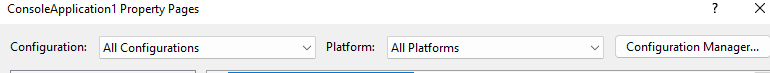
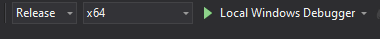
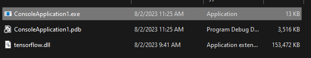
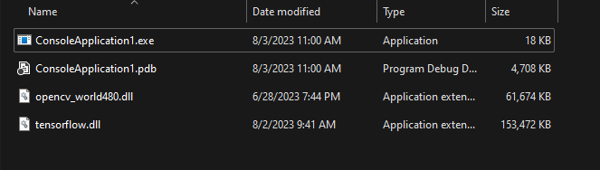

# How to build Tensorflow C++ library for Windows
This tutorial help people who are strugling with building Tensorflow C++ library for Windows and use it with OpenCV. I will show you how to build Tensorflow C++ library for Windows from source using bazel and Visual Studio 2019.

## TODO
- [x] Tut install
- [x] Tut build
- [x] Tut run example with tensorflow
- [x] Tut run example with tensorflow + opencv

## Prerequisites
- Windows 10
- Visual Studio 2019 and Build Tools
- Python 3.8
- bazel 3.1.0
- MSYS2
- Tensorflow 2.4.4 (CPU only)

```markdown
***Note***: You can change the version of Tensorflow and bazel, due to the compatibility of Tensorflow and bazel, you can check the compatibility [here](https://www.tensorflow.org/install/source_windows#tested_build_configurations).
```

## Step 1: Install Python 3.8
- Download Python 3.8 from [here](https://www.python.org/downloads/release/python-380/).
- Install Python 3.8.
- Remember to check the box "Add Python 3.8 to PATH" when installing Python 3.8.
- Test Python 3.8 by openning CMD and type command:
    ```bash
    python --version
    ```

 
## Step 2: Install bazel 3.1.0
- Download bazel 3.1.0 from [here](https://github.com/bazelbuild/bazel/releases)
- Change the file name to `bazel.exe`
- Copy the file to `C:\bazel`
- Add `C:\bazel` to PATH environment variable.
- Test bazel by openning CMD and type command:
    ```bash
    bazel --version
    ```
 
## Step 3: Install MSYS2
- Download MSYS2 from [here](https://www.msys2.org/).
- Install MSYS2.
- Add `C:\msys64\usr\bin` to PATH environment variable.
- Test MSYS2 by openning CMD and type command:
    ```bash
    mintty --version
    ```

## Step 4: Install Visual Studio 2019 and Build Tools
- Download Visual Studio 2019 from [here](https://visualstudio.microsoft.com/downloads/).
- Download Build Tools from [here](https://visualstudio.microsoft.com/downloads/#build-tools-for-visual-studio-2019).
- Install Visual Studio 2019 and Build Tools.
- Remember to check the box `Desktop development with C++`, `MSVC v142-VS2019 C++ build tools` and `Windows 10 SDK` when installing Visual Studio 2019.

## Step 5: Build Tensorflow 2.4.4
- Open CMD and type command:
    ```bash
    git clone https://github.com/tensorflow/tensorflow -b v2.4.4 --depth 1
    ```
- Open the project and install requirements listed under `REQUIRED_PACKAGES` in `tensorflow\tools\pip_package\setup.py`
- Some Bug Fixing Before Compiling:
    > Before we start, we should edit the TensorFlow source code, because you will end up with linking errors (unresolved external symbols LK2019) as shown below if you follow the typical framework building steps.
    >
    >
    >Session and SessionOptions symbols are not exported
    So what are these errors?
    >
    >Dynamic-link library(DLL) can only expose a maximum of 60,000 symbols which is one of DLL limitation. As TensorFlow has more than 60,000 symbols, so we have to manually choose which symbols to be exposed if they are not exposed from TensorFlow by default.
    >
    >According to the experience, in order to deploy a TensorFlow model, the TensorFlow Session and SessionOptions Classes are required to be exported. The steps include:
    >
    >Edit tensorflow\core\public\session.h
    >Firstly, include TensorFlow macro header.
    <image src="./assert/macro.webp" width="100%" height="100%" description="Include TF Macro at session.h" />
    >Secondly, add TF_EXPORT in front of any function definition or class definition that caused the missing symbol error.
    <image src="./assert/1.webp" width="100%" height="100%" />
    <image src="./assert/2.webp" width="100%" height="100%" />
    <image src="./assert/3.webp" width="100%" height="100%" />
    >2. Edit TensorFlow/core/public/session_options.h
    >
    >Same as session.h, include the macro header and add TF_EXPORT in front of any function definition or class definition that caused the missing symbol error.
    >
    ><image src="./assert/4.webp" width="100%" height="100%" />
    ><image src="./assert/5.webp" width="100%" height="100%" />
    >If you are facing any missing symbol during your development, you can follow similar steps to export function or class and rebuild again.
    >
    >Now, we are ready to start the compilation. 

 - Build Tensorflow 2.4.4 by openning CMD and type command:
    ```bash
    bazel build --config=opt //tensorflow:tensorflow.dll
    bazel build --config=opt //tensorflow:tensorflow.lib
    bazel build --config=opt //tensorflow:install_headers
    ```
 - ***Note***: If you got stuck while building tensorflow.dll (the terminal hang at compiling... but the timming still running), you can try to restart the computer and build again (without running `bazel clean`).
 - After building, you will get `tensorflow.dll` and `tensorflow.lib` at `tensorflow\bazel-bin\tensorflow` and `headers` at `tensorflow\bazel-bin\tensorflow\include`.
## Step 6: Build Tensorflow C++ Example
- Create a new project in Visual Studio 2019.
- Choose `Console App` and `C++` as the project type.
- Go to `Project Properties` -> `C/C++` -> `General` -> `Additional Include Directories` and add relative path to `tensorflow\bazel-bin\tensorflow\include` folder and `tensorflow\bazel-bin\tensorflow\include\src` folder in Tensorflow build output to the list.
- Go to `Project Properties` -> `Linker` -> `General` -> `Additional Library Directories` and add `tensorflow\bazel-bin\tensorflow` to the list.
- Go to `Project Properties` -> `Linker` -> `Input` -> `Additional Dependencies` and add `tensorflow.lib` to the list.
- Go to `Build Events` -> `Post-Build Event` -> `Command Line` and add `xcopy /y /d "<tensorflow.dll relative path>" "$(OutDir)"`
- ***Note***: Remember to change Configuration to **All Configuration** and Platform to **All Platforms**

    

    
- Create a new file `main.cpp` and copy the code below:
    ```C++
    #define NOMINMAX

    #include <iostream>
    #include "tensorflow/core/framework/graph.pb.h"
    #include "tensorflow/core/public/session.h"
    #include "tensorflow/core/public/version.h"
    int main() {
        std::cout << tf_git_version() << std::endl;
        std::unique_ptr<tensorflow::Session> session(tensorflow::NewSession({}));
        return 0;
    }
    ```
- The `#define NOMINMAX` to avoid the error `min` and `max` are defined in `windef.h` and `winnt.h` in Windows SDK.
- Build the project and you will get the Console execution at `$(OutDir)`.

    

## Step 7: Add Opencv
- Download Opencv from [here](https://opencv.org/releases/).
- Extract by running the .exe file and copy the folder `opencv\build\include` to `tensorflow\bazel-bin\tensorflow\include`.
- Go to `Project Properties` -> `C/C++` -> `General` -> `Additional Include Directories` and add relative path to `tensorflow\bazel-bin\tensorflow\include\opencv2` folder in Tensorflow build output to the list.
- Go to `Project Properties` -> `Linker` -> `General` -> `Additional Library Directories` and add `opencv\build\x64\vc16\lib` to the list.
- Change Configuration to **Debug** and Platform to **x64**.
    - Go to `Project Properties` -> `Linker` -> `Input` -> `Additional Dependencies` and add `opencv_world480d.lib` to the list.
    - Go to `Build Events` -> `Post-Build Event` -> `Command Line` and add `xcopy /y /d "<opencv_world480d.dll relative path>" "$(OutDir)"`
- Change Configuration to **Release** and Platform to **x64**.
    - Go to `Project Properties` -> `Linker` -> `Input` -> `Additional Dependencies` and add `opencv_world480.lib` to the list.
    - Go to `Build Events` -> `Post-Build Event` -> `Command Line` and add `xcopy /y /d "<opencv_world480.dll relative path>" "$(OutDir)"`

- Edit file `main.cpp` and copy the code below:
    ```C++
    #define NOMINMAX

    #include <iostream>
    #include "tensorflow/core/framework/graph.pb.h"
    #include "tensorflow/core/public/session.h"
    #include "tensorflow/core/public/version.h"
    /*
    int main() {
        
        return 0;
    }
    */
    #include <opencv2/opencv.hpp>
    #include <iostream>

    using namespace cv;
    using namespace std;

    int main(int argc, char** argv)
    {
        std::cout << tf_git_version() << std::endl;
        std::unique_ptr<tensorflow::Session> session(tensorflow::NewSession({}));
        // Read the image file
        Mat image = imread("<Your Test Image Path>");
        // Check for failure
        if (image.empty())
        {
            cout << "Image Not Found!!!" << endl;
            cin.get(); //wait for any key press
            return -1;
        }
        // Show our image inside a window.
        imshow("Image Window Name here", image);

        //// Wait for any keystroke in the window
        waitKey(0);
        return 0;
    }
    ```
- Build the project and you will get the Console execution at `$(OutDir)`.

    

## Reference
- [Tensorflow C++ API](https://www.tensorflow.org/api_docs/cc)
- [Build TensorFlow from Source on Windows 10](https://medium.com/vitrox-publication/deep-learning-frameworks-tensorflow-build-from-source-on-windows-python-c-cpu-gpu-d3aa4d0772d8)
- [build tensorflow 1.14 source for Windows](https://github.com/sitting-duck/stuff/tree/master/ai/tensorflow/build_tensorflow_1.14_source_for_Windows)
- [Walkthrough: Create and use your own Dynamic Link Library (C++)](https://learn.microsoft.com/en-us/cpp/build/walkthrough-creating-and-using-a-dynamic-link-library-cpp?view=msvc-160)